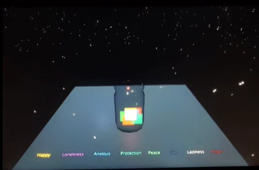
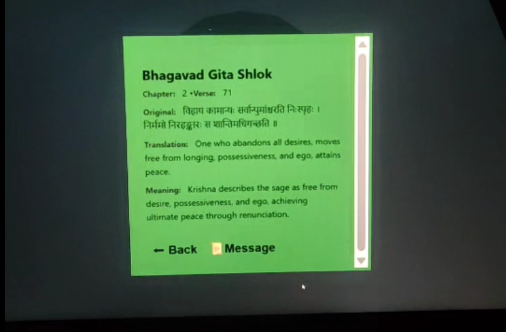

<div align="center">
  <h1> Shlokas 3D Emotion Explorer </h1>
  <p>An interactive, 3D visually stunning React application combining traditional shlokas with modern emotional reflection.</p>

  [](https://react.dev)
  [](https://vitejs.dev)
  [](https://threejs.org)
  [](https://docs.pmnd.rs/react-three-fiber/getting-started/introduction)
  [](https://nodejs.org)
  [](https://mongodb.com)

</div>

---

## About the Project

**Shlokas** is an immersive web application designed to help users reflect on their emotions. By interacting with a beautiful 3D Starfield and a mystical **Jar**, users can select how they are feeling, fetch relevant wisdom through traditional shlokas, and experience dynamic animated chits. 

<details>
<summary><b> View Screenshots</b> <i>(Click to expand)</i></summary>
<br>

Here is a glimpse of the Shlokas 3D experience:





</details>

---

##  Interactive Features

<details>
<summary> <b>3D Interactive Scene</b></summary>
Powered by <code>@react-three/fiber</code> and <code>@react-three/drei</code>, the app features a responsive 3D environment including a floating spiritual jar, a glowing star field, and dynamic ground interactions.
</details>

<details>
<summary> <b>Emotion-Based Guidance</b></summary>
The scene provides "Emotion" buttons that allow the user to convey their current state. Based on these inputs, specific Chits displaying Shlokas and translations fly out toward the screen.
</details>

<details>
<summary><b>GSAP Animations</b></summary>
Seamless, buttery-smooth transition animations using <code>gsap</code> to handle UI elements and 3D objects moving in space.
</details>

<details>
<summary>☁️ <b>Network QR Code Sharing</b></summary>
The frontend comes built-in with a Modal to quickly generate a QR code of your local IPv4 address, allowing you to instantly share the live experience with another device on the same local network!
</details>

---

## Technology Stack

### Frontend (`/shlok-frontend`)
- **Framework & Build:** React 19, Vite
- **3D Rendering:** Three.js, React Three Fiber, React Three Drei
- **Animations:** GSAP
- **Post-processing:** `@react-three/postprocessing`
- **Network Requests:** Axios

### Backend (`/shlok-backend`)
- **Runtime:** Node.js
- **Server:** Express.js
- **Database:** MongoDB (Mongoose)
- **Middleware:** CORS, Dotenv

---

##  Getting Started

To run this project locally, you will need to start both the backend server and the frontend development server.

### 1. Start the Backend

Open a terminal and run the following:

```bash
cd shlok-backend
npm install
npm run dev # or node app.js
```

### 2. Start the Frontend

Open a new terminal tab/window and run:

```bash
cd shlok-frontend
npm install
npm run dev -- --host
```
> **Note:** The `--host` flag enables network access, exposing your local IP (0.0.0.0) so the QR Code App Sharing feature works properly!

---


---

<div align="center">
  <p>Crafted with ❤️ and Code.</p>
</div>
